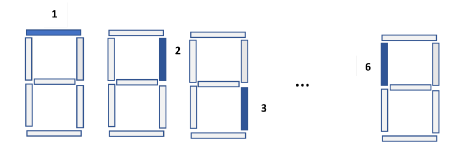
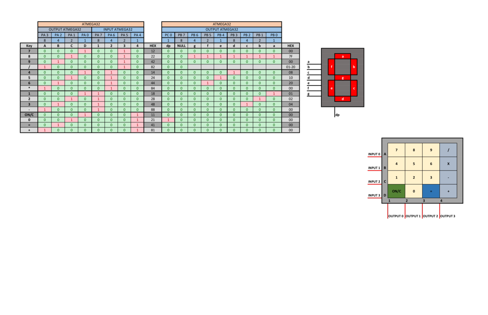

# ATMega32 in Assembly

Projects in`Assembly` with `Atmel Studio`, `AVR Studio` and, simulated on `Proteus`

1 - Connect a 4x4 keypad to a micro. If one of the keys numbered one to seven is pressed, one of the 7-segment LEDs connected to another port should light up. Each of the LEDs have a number according to the below figure and only one LED lights up at a time.

2 - If key number 8 is pressed, all the LEDs light up and remain on approximately for 4 seconds.

3 - If key number 9 is pressed, the keypad locks, meaning all LEDs turn off and it does nothing unless key 9 is pressed again to return to normal mode.

4 - If key 10 is pressed, it leads to creating a light dance in the LEDs. In other words, LEDs 1 to 6 (the central LED 7 is not involved) light up and turn off sequentially (with a customizable time interval, for example, half a second).

